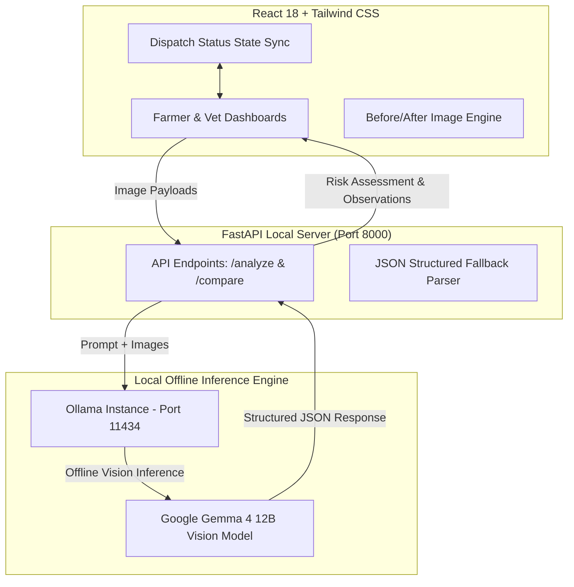

# 🛡️🐔 FlockGuard

**Local AI poultry & livestock health early-warning platform**

Powered by Google's **Gemma 4 12B**, running 100% locally via **Ollama** — no cloud, no internet required.


---

## 📖 Table of Contents

- [The Problem](#-the-problem)
- [The Solution](#-the-solution)
- [Why Gemma 4 12B](#-why-gemma-4-12b)
- [How It Works](#-how-it-works)
- [Key Features](#-key-features)
- [System Architecture](#-system-architecture)
- [Tech Stack](#️-tech-stack)
- [Getting Started](#-getting-started)
- [Demo Workflow](#-demo-workflow)
- [Roadmap](#-roadmap)
- [Safety Disclaimer](#️-safety-disclaimer)

---

## 🌍 The Problem

Outbreaks of Highly Pathogenic Avian Influenza (HPAI / Bird Flu) and Swine Influenza threaten food security, animal welfare, and rural livelihoods across India, Southeast Asia, Africa, Latin America, and Western nations alike.

```
 SUBTLE BEHAVIORAL CHANGES        SURGE MORTALITY             MASS CULLING & BANKRUPTCY
[Huddling & Reduced Activity] ──► [Sudden Death in Barns] ──► [Entire Flock Eradication]
      Day 1 – Day 2                  Day 3 – Day 4                  Day 5 onward
```

- **Global impact:** The poultry sector has lost over **$100 billion** in direct and indirect losses to recurring avian influenza outbreaks.
- **Per-farm ruin:** A single outbreak in a mid-sized flock (10,000–100,000 birds) can cause **$250,000–$800,000+** in direct losses, wiping out smallholder savings.
- **The 48-hour cliff:** HPAI can reach up to 100% mortality once transmission peaks in closed or semi-open coops. Farmers usually notice only when dozens of birds die overnight — by then, biosecurity is already compromised.

## 💡 The Solution

FlockGuard bridges the gap between **early behavioral anomalies** and **emergency veterinary triage**. By running Gemma 4 12B locally inside the barn network, it analyzes flock imagery in real time — completely offline — detecting subtle spatial distribution shifts and behavioral markers *before* mass mortality occurs.

## 💎 Why Gemma 4 12B

Unlike cloud-dependent AI platforms that fail in rural environments, FlockGuard is built around Gemma's core strengths:

| Strength | What it means for farmers |
|---|---|
| 📵 **100% offline execution** | Most poultry farms (e.g., rural Maharashtra, Punjab, Tamil Nadu, and rural zones worldwide) have no reliable connectivity. Gemma runs on local barn hardware or edge gateways via Ollama — a farmer can capture an image in a remote coop and get instant anomaly scoring without sending a single byte over the internet. |
| 🌐 **Multilingual by default** | Hindi, Marathi, Telugu, Spanish, French, Swahili, Vietnamese and more — Gemma interprets queries and visual context and returns structured observations in the farmer's native language. |
| 📱 **Lightweight & edge-ready** | High-parameter vision reasoning at an optimized memory footprint, deployable on low-cost devices for small-scale farmers. |

## 📸 How It Works

FlockGuard is a closed-loop, two-step emergency dispatch engine connecting offline farmers directly to regional veterinary dispatchers.

```
┌────────────────────────────────────────────────────────────────────────┐
│ STEP 1 — Farmer Portal (Local Capture & Gemma Delta Analysis)          │
│ 📷 Upload Reference (healthy) vs. Current flock image                  │
│ 🤖 Offline Gemma 4 12B analyzes movement density & anomaly score       │
│ 🚨 Farmer triggers "Dispatch Urgent Vet Request"                       │
└───────────────────────────────┬────────────────────────────────────────┘
                                │ Real-time local alert payload
                                ▼
┌────────────────────────────────────────────────────────────────────────┐
│ STEP 2 — Veterinary Dispatch Console (Triage & On-Site Visit)          │
│ 📍 Vet sees farm location (e.g., Barn #4 – North Wing, Sector B7)      │
│ 📊 Reviews visual evidence & Gemma key indicators (+65% density)       │
│ 🟢 Clicks "Accept Visit & Dispatch Veterinarian"                       │
└────────────────────────────────────────────────────────────────────────┘
```

### Step 1 — Farmer Flock Surveillance Portal

- **Image delta capture:** Upload a *Healthy Reference Image* and a *Current Observation Image* (or load a demo preset).
- **Local Gemma 4 inference:** Gemma computes spatial clustering and movement density offline, producing a **Flock Health Index** and flagging critical behavioral changes.
- **Emergency trigger:** When an anomaly is detected, the farmer clicks **Dispatch Urgent Vet Request** to send an emergency package to the veterinary console.

### Step 2 — Veterinary Emergency Dispatch Console

- **Exact location:** The alert pinpoints the source (e.g., *Barn #4 – North Wing, Sector B7*), so the vet knows precisely where to go.
- **Visual proof:** Side-by-side Baseline vs. Anomaly images captured by the farmer are attached.
- **Urgency & indicators:** Gemma-generated metadata (e.g., `+65% density grouping`, `14 stationary birds detected`) appears alongside a **HIGH ANOMALY URGENCY** tag.
- **One-click dispatch:** The vet accepts the visit, routing the team to the barn and updating the farmer's status badge.

## ✨ Key Features

1. **🔒 Private, on-farm offline AI** — Gemma 4 12B runs on local edge hardware via Ollama. No video or images ever leave the farm network, and uptime is guaranteed even during complete cellular outages.
2. **🔄 "Before vs. After" visual baseline delta engine** — Instead of analyzing isolated frames, FlockGuard compares a healthy reference against the current observation to surface:
   - Clustering density increases (e.g., +60% grouping in cold/fever zones)
   - Activity reduction (stationary postures vs. baseline)
   - Positional posture anomalies (drooped wings, lowered heads)
3. **🌐 Multilingual farmer interface** — Reports and guidance rendered in the farmer's local language.
4. **🔁 Integrated dual-portal closed loop** — Farmer view generates observation reports and pushes structured anomaly payloads; Veterinary view receives geo-tagged alerts with proof, and dispatch reflects back on the farmer dashboard as **"Veterinarian Dispatched."**
5. **🛡️ Responsible, non-clinical AI** — FlockGuard never claims a clinical diagnosis (e.g., "Bird Flu Confirmed with 92% Accuracy"). It scores **Visible Anomaly Risk** and provides evidence-backed recommendations for human veterinary inspection.

## 🏗 System Architecture



## 🛠️ Tech Stack

| Layer | Technology |
|---|---|
| Frontend | React 18, Vite, Tailwind CSS, Lucide React |
| Backend | Python 3.10+, FastAPI, Uvicorn, Pydantic |
| AI Runtime | Ollama running `gemma4:12b` locally |


## 🚀 Getting Started

### 1. Install & launch Gemma 4 via Ollama

Make sure [Ollama](https://ollama.com) is installed and running, then:

```bash
# Pull and run the Gemma 4 12B vision model (works offline once pulled)
ollama run gemma4:12b
```

### 2. Set up the FastAPI backend

```bash
# Clone the repository
git clone https://github.com/tushar-313/hacktoberfest_hackday.git
cd hacktoberfest_hackday/backend

# Install dependencies
pip install -r requirements.txt

# Launch the server at http://localhost:8000
uvicorn main:app --reload --port 8000
```

### 3. Set up the React frontend

```bash
cd ../frontend

npm install
npm run dev
```

Open **http://localhost:5173** in your browser.

## 🎮 Demo Workflow

1. Open the **Farmer Portal** at `http://localhost:5173`.
2. **Load demo case:** click **Load High-Risk Anomaly Case** to pre-fill baseline and anomaly images.
3. **Run local inference:** click **Run Local AI Delta Analysis** to trigger step-by-step vision processing.
4. **Review evidence:** examine the risk breakdown, observations, and safety uncertainty notice generated by Gemma.
5. **Dispatch vet:** click **Dispatch Urgent Vet Request**.
6. **Switch to Veterinary View** using the toggle in the top-right navbar.
7. **Accept visit:** review the incoming alert (location + proof images), then click **Accept Visit & Dispatch Veterinarian**.
8. **Verify sync:** switch back to the Farmer view to see the green **"Veterinarian Dispatched"** banner.

## 🗺️ Roadmap

**Current MVP scope:** single-frame and double-frame static visual analysis.

- [ ] Thermal imaging pipeline to detect fever spikes before posture shifts occur
- [ ] Multi-camera RTSP stream sampling for continuous 24/7 barn scanning
- [ ] Edge deployment on Raspberry Pi / NVIDIA Jetson devices inside farm enclosures

## ⚠️ Safety Disclaimer

FlockGuard is a **decision-support early-warning tool** powered by computer vision and local AI. It does **not** perform clinical laboratory tests or issue definitive veterinary diagnoses. All high-risk alerts must be confirmed through physical examination and laboratory sampling by a licensed veterinarian.