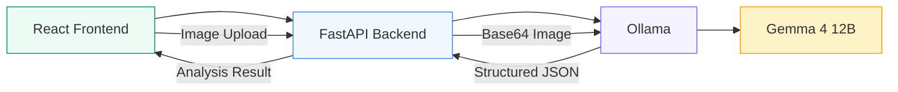

# 🛡️ FlockGuard — Local AI Poultry Health Early-Warning Platform

**FlockGuard** is a local AI-powered poultry/livestock health early-warning platform that helps farmers identify potentially concerning changes in flock behavior from images — all processed entirely on-device using **Gemma 4 12B** via **Ollama**.

---

## 🎯 Problem

Early detection of health issues in poultry flocks is critical. Traditional monitoring is time-intensive, subjective, and often misses subtle changes. By the time problems are visible to the naked eye, they may have already spread.

## 💡 Solution

FlockGuard provides AI-assisted visual analysis of flock images:
- **Single image analysis** — Upload a flock image and get instant AI observations
- **Before/After comparison** — Compare a baseline image with a current image to detect meaningful visible changes
- **Risk assessment** — Get structured risk levels based on visible anomalies
- **Veterinary alerts** — Create alerts that veterinarians can accept and respond to
- **100% local** — All AI inference runs on your machine, your data never leaves your device

## 🤖 Why Gemma 4 12B?

- **Multimodal** — Natively understands images, no external vision APIs needed
- **Local inference** — Runs entirely on your hardware via Ollama
- **Privacy** — Farm images contain sensitive operational data; local processing ensures complete privacy
- **No API costs** — Zero per-query costs after initial setup
- **Offline capable** — Works without internet connectivity

## 🏗️ Architecture



```
React (Vite + Tailwind)  →  FastAPI (Python)  →  Ollama  →  Gemma 4 12B
     :5173                      :8000               :11434      (local)
```

## ✨ Features

### Farmer Dashboard
- 📊 Health Index with visual risk indicator
- 📸 Drag-and-drop image upload
- 🔄 Before/After flock comparison
- 🤖 AI-powered visual analysis with structured observations
- ⚠️ Risk assessment (LOW / MODERATE / HIGH / CRITICAL)
- 📋 Evidence list and recommended actions
- 🚨 Create veterinary alerts
- 🚗 Real-time vet dispatch status

### Veterinarian Dashboard
- 📥 Incoming farm alert feed
- 👁️ View detailed evidence
- ✅ Accept visit workflow
- 🏁 Mark visits as resolved

### Demo Mode
- 🎮 3 pre-loaded demo cases for instant demonstration
- No need to find images during a live demo

### Safety
- ⚕️ Never claims to diagnose diseases
- 🛡️ Clear uncertainty notices on all AI output
- 📝 Distinguishes observations from recommendations

## 🚀 Quick Start

### Prerequisites

- [Ollama](https://ollama.ai/) installed
- Python 3.10+
- Node.js 18+

### 1. Start Ollama with Gemma 4

```bash
ollama run gemma4:12b
```

> Keep this running in a separate terminal. First run will download the ~7.6GB model.

### 2. Start the Backend

```bash
cd flockguard/backend
pip install -r requirements.txt
uvicorn main:app --reload --port 8000
```

### 3. Start the Frontend

```bash
cd flockguard/frontend
npm install
npm run dev
```

### 4. Open the App

Navigate to [http://localhost:5173](http://localhost:5173)

## 🎬 Demo Workflow

1. Open the app at `localhost:5173`
2. Click **"Healthy → Concerning"** demo case (right sidebar)
3. Click **"Compare With Previous"**
4. Watch the animated analysis progress
5. Review the AI observations, evidence, and risk assessment
6. Click **"Create Veterinary Alert"**
7. Switch to **Veterinarian** view (top-right toggle)
8. See the incoming alert with all observations
9. Click **"Accept Visit"**
10. Switch back to **Farmer** view
11. See **"Veterinarian Dispatched"** banner

## ⚠️ Limitations

- **Not a veterinary diagnostic tool** — Provides visual anomaly detection only
- **Image quality dependent** — Results are only as good as the input images
- **No persistent storage** — Alerts are stored in-memory (resets on server restart)
- **No authentication** — MVP assumes trusted local network
- **Single user** — No multi-user or multi-farm support
- **No real GPS** — Farm locations are simulated

## 🔮 Future Improvements

- Persistent database (SQLite/PostgreSQL)
- Multi-farm management
- Time-series tracking of flock health over weeks
- Mobile-responsive camera integration
- Push notifications for veterinarians
- Historical analysis dashboard
- Multi-user authentication
- Integration with farm management systems

## 📄 License

MIT — Built during Hacktoberfest 2026 Hackday 🎃
